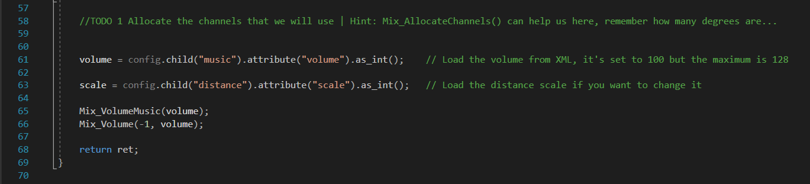
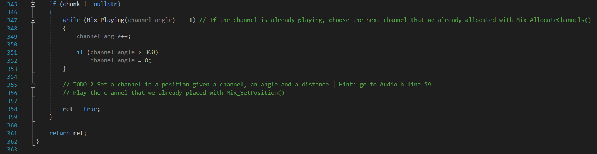
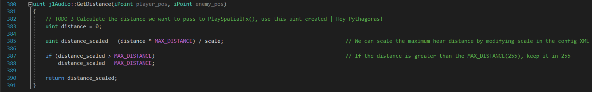
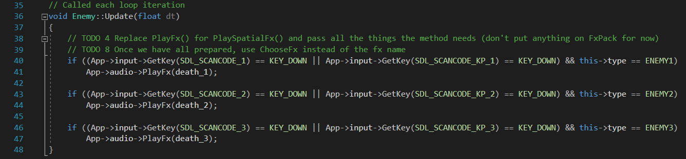
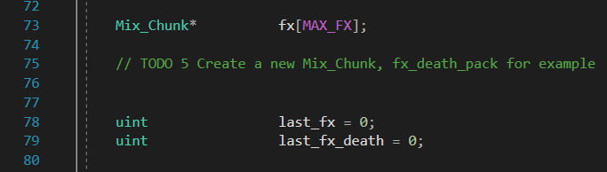
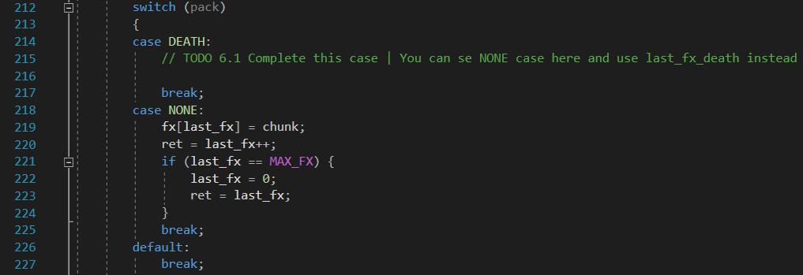
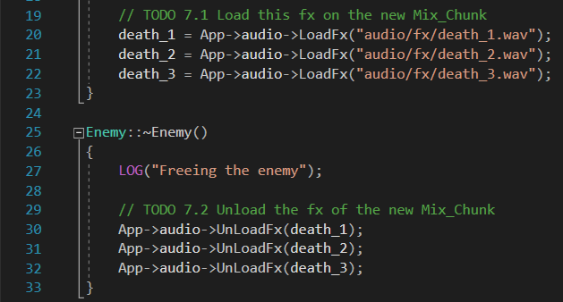

I am [Sergio Gómez](https://www.linkedin.com/in/sergio-gómez-b81b69184/), student of the [Bachelor’s Degree in Video Games by UPC at CITM](https://www.citm.upc.edu/ing/estudis/graus-videojocs/). This content is generated for the second year’s subject Project 2, under supervision of lecturer [Ricard Pillosu](https://es.linkedin.com/in/ricardpillosu).

# Introduction

Here I will talk about two problems about the audio in our games and how to work these problems and put our games in another level of audio. First we'll see how to make spatial audio work and with a little tweaks in the audio module, how to play random fx from the same type on a unic emitter. You can download the release [here](https://github.com/Sersius/Audio-Research/releases/tag/0.1) and follow all the steps.

# Music Manager

First I recommend to have the SDL_mixer [documents](https://www.libsdl.org/projects/SDL_mixer/docs/SDL_mixer.pdf) open in case you want to check something that you don't understand perfectly or if something mentioned in this web you don't see it clearly.

# Spatial Audio

Spatial audio is a manipulation of the sound that makes the feeling of a 3D space, you can listen [here](https://upfa3d.wordpress.com/category/spatial-audio/) videos that show this effect. This emerged in the 1990s in PC and Game Consoles, for make the feeling of immersion and in FPS games like Counter Strike or Call of Duty, this effect is essential because these are games wich requier a high level of reaction, and with the spatial audio the players can hear if an enemy is coming from any direction.

## Basic knowledge

In order to start with the TODOs of the spatial audio, I will explain some terms that I think are usefulls

* **Mix_Chunk:** Is the internal format for an audio chunk and where is stored the sample data, the length in bytesof that data, and the volume to use when mixing the sample.

* **Channel:** Is where the chunk will be played.

* **Mix_SetPosition:** With this function we emulate a simple 3D audio effect, set the position of a channel depending of the angle and the distance you pass.

* **Mix_PlayChannel:** Play a chunk in a channel that we pass.

## Functions for spatial audio

There are two functions for the correct execution of the spatial audio

* **GetAngle**

```
uint j1Audio::GetAngle(iPoint player_pos, iPoint enemy_pos)
{
	iPoint vector_pos = player_pos - enemy_pos;		        // The vector of the player and enemy positions
	iPoint vector_axis = { 0, 1 };				        // We use the this vector because we want the angle that is formed with the Y axis

	double dot_x = vector_axis.y * vector_pos.y;			// Product of the two vectors to get the X position
	double det_y = -(vector_axis.y * vector_pos.x);                 // Determinant of the two vectors to get the Y position

	float f_angle = (atan2(det_y, dot_x)) * RAD_TO_DEG;		// Arc tangent of the previous X and Y, multiply the result with RAD_TO_DEG to get the result in degrees instead of radiants

	if (f_angle < 0)			                        // If the angle is negative we add +360 because in PlaySpatialFx() we need the channel to be positive
		f_angle += 360;

	return uint(f_angle);
}
```
This function calculate the angle with the atan2 given the Dot product and the determinant. In case the angle is negative we add +360 for when we pass it to PlaySpatialFx(), because we will use this angle "as a channel" and a channel can't be negative.

* **GetDistance**

```
uint j1Audio::GetDistance(iPoint player_pos, iPoint enemy_pos)
{
	// TODO 3 Calculate the distance we want to pass to PlaySpatialFx(), use this uint created | Hey Pythagoras!
	uint distance = 0;

	uint distance_scaled = (distance * MAX_DISTANCE) / scale;	// We can scale the maximum hear distance by modifying scale in the config XML

	if (distance_scaled > MAX_DISTANCE)			        // If the distance is greater than the MAX_DISTANCE(255), keep it in 255
		distance_scaled = MAX_DISTANCE;

	return distance_scaled;
}
```

With this function we calculate the distance thatis between the player and the channel that emits the sound. We can scale the max distance with the variable scale modifying it on the config.xml.

Now we know some of this let's start with the TODOs!

### TODO 1

Allocate the channels that we will use, remember how many degrees are...
We have to allocate channels for play the chunks later, we must have control of this chunks.



### TODO 2

Set a channel in a position given a channel, an angle and a distance and play the channel that we already placed with Mix_SetPosition()
Once we allocated the channel now we can place it in a concrete position and play it.



### TODO 3

Calculate the distance we want to pass to PlaySpatialFx(). Here is easy as pythagoras, if you don't remember some usefull function from math.h are pow() and sqrt().



### TODO 4

Replace PlayFx() for PlaySpatialFx() and pass all the things the method needs (don't put anything on FxPack for now), with all this now we can hear spatial audio. Play a little with the scale from the XML.



Now we have a magnificent spatial audio to enjoy, but this is not over yet.

## Make a different Mix_chunk for the same action

Sometimes when we are playing a game and an enemy dies, it always sound the same, doesn't change his death sound. With this implementation the same enemy will die with diferent sounds choseen randomly.

* **ChooseFx**

```
uint j1Audio::ChooseFx(FxPack pack)	// Choose an audio on the standar Mix_Chunk* or on a self-made one
{
	uint fx_num = 0;

	switch (pack)
	{
	case DEATH:
		// TODO 6.2 Complete this case too

		break;
	case NONE:
		while (fx[fx_num] != nullptr)
		{
			fx_num++;
		}
		break;
	default:
		break;
	}

	fx_num -= 1;

	uint fx = rand() % fx_num;

	return fx;
}
```

With this easy function, we pass an enum to choose the Mix_chunk, and then a random fx inside the Mix_chunk.

### TODO 5

Create a new Mix_Chunk, fx_death_pack for example, as simple as that



### TODO 6

Complete the case to load an fx in the new Mix_chunk, we have to do this four more times



### TODO 7

We are so close to finish! Load and Unload the fx but counting the new Mix_chunk



### TODO 8

Complete the PlaySpatialFx with the new Mix_chunk and the enum of FxPack


Now we have three enemies that when die they make different sounds.

If you want to see if your result it's ok, you can go to the full_code folder, Game, and execute the solution to compare.

## Okey, and now what?
If you enjoyed digging in SDL_mixer and the spatial audio, you can now try [OpenAl](https://www.openal.org/), this tool is created to work with 3D audio so it might be more difficult than the spatial audio you learned today but you can learn a lot more!

If you are still here I want to say thanks and hope you learned something that you didn't know today.
Thanks for your attention and bye!
